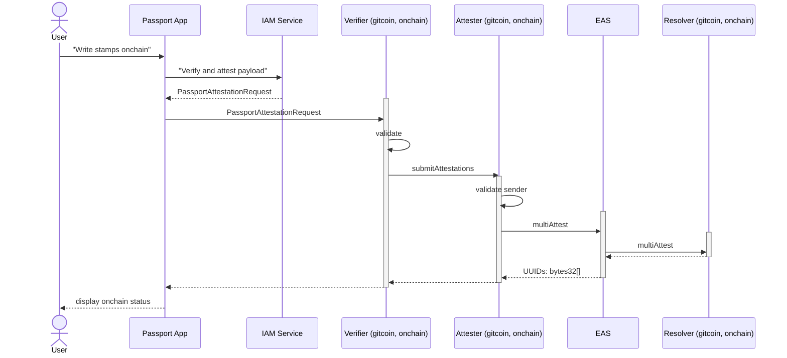

import { Callout } from 'nextra/components'

# Contract Reference

The Gitcoin smart contract stack allows developers to pull Stamp data directly from the blockchain rather than having to make requests to a centralized server. The smart contract stack is built on top of the Ethereum Attestation Service. 

This page will outline the Gitcoin Passport smart contract stack and provide all the deployment details you need to integrate onchain Stamp data in your app. 

We also discuss the onchain use cases in the following resources:
* [Tutorial: Building an app using onchain Passport data](tutorials/integrating-onchain-stamp-data)
* [Why build with onchain Passport](major-concepts/onchain-passports)


## Overview

Attestations are digital records that are cryptographically signed by some trusted attester. In this case, Gitcoin signs to verify that a user has a Stamp, which is then accessible to developers who can access this data from the smart contract.

Here is a summarized diagram to help illustrate both of these processes:



## Table of contents

This page is broken into several sections:
* [How Gitcoin adds Passport metadata to the blockchain](#how-gitcoin-adds-passport-metadata-to-the-blockchain)
* [How you can query for onchain Passport metadata](#how-you-can-query-for-onchain-passport-metadata)
* [Contract addresses](#contract-addresses)
* [Schema](#schema)


## How Gitcoin adds Stamps to the blockchain

Gitcoin has an attester contract that allows trusted Gitcoin addresses to create attestations, confirming to the schema, that demonstrate that a user owns some set of Stamps, and contains all the necessary metadata about those Stamps. The `Attestation` has a unique identifier (`uuid`) that connects all this data to the user's specific address.

This is the flow Gitcoin uses:

1. A user decides to migrate their Stamps onchain using the Passport app
2. The Passport app requests a list of verified Stamps from the Gitcoin IAM server
3. The Passport app then requests the `GitcoinVerifier` contract to create an Attestation containing the verified Stamps
4. The Attestation is passed from the `GitcoinVerifier` contract to the `GitcoinAttester` contract where the sender address is verified and then the Attestation is forwarded to the `EAS` contract.
5. The EAS contract adds the Attestation to the blockchain and assigns it a unique identifier known as a `UID`.
6. The EAS contract sends the user address and UID to the `Resolver` contract, where it is stored.

### Private Gitcoin contracts

#### GitcoinVerifier contract

The verifier validates the Passport data that a user wants to bring onchain. The validation is performed by checking the EIP-712 signature for the data that is sent in by the Passport app. The EIP-712 signature will be created by the Passport IAM Service which is the same service that issues the Stamps (verifiable credentials) for the Passport applications.

The flow when the user triggers the process to bring their data onchain from the Passport app is the following:

- The Passport App creates a payload with the data to be written onchain (a list of stamps) and sends this to the IAM Service
- The IAM service validates that data and signs it with the EIP-712 procedure
- The Passport App will call the GitcoinVerifier function verifyAndAttest
- The signature of the data will be validated, and validation passes the function submitAttestations(MultiAttestationRequest[] calldata multiAttestationRequest) and the GitcoinAttester will be called to write the data to the EAS protocol

##### Fee

A small fee is collected by the verifier each time data is written onchain. When the `verifyAndAttest` method in the `GitcoinAttester` contract is called, it will check if the expected amount of ETH has been sent to the smart contract, and will revert if not.

The amount of the fee is determined by the IAM server, and it is the equivalent of 2 USD in ETH. The fee is part of the data structure that is signed with the EIP-712 procedure, so that it cannot be changed during the process of writing Stamps onchain.

##### Replay protection

In order to prevent against replay attacks, the Passport structure that is passed in the `verifyAndAttest` function call must contain a transaction counter (known as a nonce).

This nonce is unique per recipient. The nonce will start from 0, and it will be incremented by 1 for each call that is made to the `verifyAndAttest` function for the specified recipient.

The Passport structure must contain the correct (the next) nonce for the recipient, in order for the call to `verifyAndAttest` to succeed. It will be reverted otherwise.

#### GitcoinAttester contract

The attester is an ownable smart contract that includes a function for forwarding Attestation data to the `EAS` contract. There is an allow-list of verified senders that can call the `submitAttestations` function - currently only Gitcoin is on the list. Addresses on the allow-list can add or remove other addresses from the allow-list and set the address for the EAS contract.

## How you can query for onchain Passport data

<Callout type="info">
Please note that you we've only released smart contracts that enable you to request onchain Stamp data. The Gitcoin team is actively working on a new smart contract that will deliver Passport score data. 

We provide instructions for how you can generate a Passport score using Stamp data and weights in the following tutorial:
[Building an app using onchain Passport data](tutorials/integrating-onchain-stamp-data)
</Callout>

This is the flow that you will use to request onchain Passport data:

1. A request is sent to the `Resolver` contract passing the user address
2. The `Resolver` contract returns a `UID`
3. The `UID` is passed to the `EAS` contract
4. The `EAS` contract returns an encoded `Attestation`
5. The user decodes the `Attestation` and extracts the Stamp data

### Publicly available contracts

#### GitcoinResolver contract

The `GitcoinResolver` contract is used to request a `UID` for an address.

The Attestations are stored in a mapping, where the Attestation is stored as raw bytes (allowing Attestations with any schema to be included).

In order to ensure the integrity of the data that the contract stores, the resolver smart contract shall only validate and store date from trusted sources:

- a trusted EAS contract
- a trusted Attester

#### EAS contract

The `EAS` contract is where you can pass the `UID`received from the `GitcoinResolver` contract to receive an `Attestation`.

## Contract addresses

The entire Gitcoin smart contract stack is currently deployed on Optimism Mainnet, Linea and Base Goerli.

Optimism Mainnet and Linea are **'live' Ethereum layer-2 networks**, meaning it secures real assets, transaction gas is paid in real ETH and there are real world consequences! 

Base Goerli is a **test network**, meaning the tokens there have no real world value and it can be used as a safe sandbox for developing your apps.

### Optimism Mainnet

The Optimism chain ID is [10](https://chainlist.org/chain/10).

#### Contracts

| contract        | address                                    | link                                                                                                 |
| --------------- | ------------------------------------------ | ---------------------------------------------------------------------------------------------------- |
| issuer          | 0x804233b96cbd6d81efeb6517347177ef7bD488ED | [Etherscan](https://optimistic.etherscan.io/address/0x804233b96cbd6d81efeb6517347177ef7bD488ED)      |
| EAS             | 0x4200000000000000000000000000000000000021 | [Etherscan](https://optimistic.etherscan.io/address/0x4200000000000000000000000000000000000021)      |
| GitcoinResolver | 0xc94aBf0292Ac04AAC18C251d9C8169a8dd2BBbDC | [Etherscan](https://optimistic.etherscan.io/address/0xc94aBf0292Ac04AAC18C251d9C8169a8dd2BBbDC#code) |
| GitcoinVerifier | 0xa8eD4d2C3f6f98A55cdDEd97C5aE9B932B0633A4 | [Etherscan](https://optimistic.etherscan.io/address/0xa8eD4d2C3f6f98A55cdDEd97C5aE9B932B0633A4)      |
| GitcoinAttester | 0x843829986e895facd330486a61Ebee9E1f1adB1a | [Etherscan](https://optimistic.etherscan.io/address/0x843829986e895facd330486a61ebee9e1f1adb1a)      |

#### EAS Schema

| schema   | uid                                                                | link                                                                                                                   |
| -------- | ------------------------------------------------------------------ | ---------------------------------------------------------------------------------------------------------------------- |
| passport | 0xd7b8c4ffa4c9fd1ecb3f6db8201e916a8d7dba11f161c1b0b5ccf44ceb8e2a39 | [EasScan](https://optimism.easscan.org/schema/view/0xd7b8c4ffa4c9fd1ecb3f6db8201e916a8d7dba11f161c1b0b5ccf44ceb8e2a39) |
| score    | 0x6ab5d34260fca0cfcf0e76e96d439cace6aa7c3c019d7c4580ed52c6845e9c89 | [EasScan](https://optimism.easscan.org/schema/view/0x6ab5d34260fca0cfcf0e76e96d439cace6aa7c3c019d7c4580ed52c6845e9c89) |


### Linea

The Linea chain ID is [59144](https://chainlist.org/chain/59144).

#### Contracts

| contract                   | address                                    | link                                                                                         |
| -------------------------- | ------------------------------------------ | -------------------------------------------------------------------------------------------- |
| issuer                     | 0x4B70C4308ea49d17FD946dDacD6884e8e1e18B56 | [Lineascan](https://lineascan.build/address/0x4b70c4308ea49d17fd946ddacd6884e8e1e18b56)      |
| EAS                        | 0xaEF4103A04090071165F78D45D83A0C0782c2B2a | [Lineascan](https://lineascan.build/address/0xaef4103a04090071165f78d45d83a0c0782c2b2a#code) |
| GitcoinVeraxPortal         | 0xCAa9E817f02486cE076560B77A86235Ef91c5d5D | [Lineascan](https://lineascan.build/address/0xCAa9E817f02486cE076560B77A86235Ef91c5d5D)      |
| GitcoinResolver            | 0x0a774AECE542a1A819107Eb3a06E9D515C67257a | [Lineascan](https://lineascan.build/address/0x0a774AECE542a1A819107Eb3a06E9D515C67257a)      |
| GitcoinVerifier            | 0xc94aBf0292Ac04AAC18C251d9C8169a8dd2BBbDC | [Lineascan](https://lineascan.build/address/0xc94aBf0292Ac04AAC18C251d9C8169a8dd2BBbDC)      |
| GitcoinAttester            | 0xBC778313E52b1184A15D163b5d3a72AEF8d510A2 | [Lineascan](https://lineascan.build/address/0xBC778313E52b1184A15D163b5d3a72AEF8d510A2)      |
| Verax Attestation registry | 0x3de3893aa4Cdea029e84e75223a152FD08315138 | [Lineascan](https://lineascan.build/address/0x3de3893aa4Cdea029e84e75223a152FD08315138)      |

#### EAS Schema

| schema   | uid                                                                | link                                                                                                                |
| -------- | ------------------------------------------------------------------ | ------------------------------------------------------------------------------------------------------------------- |
| passport | 0x69b9d63ff6b161097cb4930e197a722bcf423f832d4e4cd3692449d5a1e1319f | [EasScan](https://linea.easscan.org/schema/view/0x69b9d63ff6b161097cb4930e197a722bcf423f832d4e4cd3692449d5a1e1319f) |
| score    | 0x4da1eaac6346b8b79a705e3898a308062ca607f56c07762ef7b7ff8a7661843c | [EasScan](https://linea.easscan.org/schema/view/0x4da1eaac6346b8b79a705e3898a308062ca607f56c07762ef7b7ff8a7661843c) |

#### Verax schema

| schema   | uid                                                                |
| -------- | ------------------------------------------------------------------ |
| passport | 0x501e6fcade7e3483d0ae7fcfebb732907ebda12b209f5116e52c02697062a50e |
| score    | 0x01f031da36192c34057c764239eb77bb6ec8ebfb808f72a7bb172f37a5bec31f |


### Base Goerli

The Base Goerli chain ID is [84531](https://chainlist.org/chain/84531).

#### Contracts

| contract        | address                                    | link                                                                                       |
| --------------- | ------------------------------------------ | ------------------------------------------------------------------------------------------ |
| issuer          | 0x5f603Ed913738d9105bAf3BD981AA4750016B167 | [BaseScan](https://goerli.basescan.org/address/0x5f603Ed913738d9105bAf3BD981AA4750016B167) |
| EAS             | 0xAcfE09Fd03f7812F022FBf636700AdEA18Fd2A7A | [BaseScan](https://goerli.basescan.org/address/0xAcfE09Fd03f7812F022FBf636700AdEA18Fd2A7A) |
| GitcoinResolver | 0xA10606c17d94a4DBDc4dD804d1B88fF5030aeE94 | [BaseScan](https://goerli.basescan.org/address/0xA10606c17d94a4DBDc4dD804d1B88fF5030aeE94) |
| GitcoinVerifier | 0x5bC95C6e11520D25BE8c7bDf7AAc3E2eEAbD8564 | [BaseScan](https://goerli.basescan.org/address/0x5bC95C6e11520D25BE8c7bDf7AAc3E2eEAbD8564) |
| GitcoinAttester | 0x5bbbc733e12f50e6834c40a90066f2f9ffb820e0 | [BaseScan](https://goerli.basescan.org/address/0x5bbbc733e12f50e6834c40a90066f2f9ffb820e0) |

#### EAS Schema

| schema   | uid                                                                | link                                                                                                                       |
| -------- | ------------------------------------------------------------------ | -------------------------------------------------------------------------------------------------------------------------- |
| passport | 0x9d43e5c201404b9ab0913bcd6475c78e32d32a4d78233b2c309e9b6828f59e45 | [BaseScan](https://base-goerli.easscan.org/schema/view/0x9d43e5c201404b9ab0913bcd6475c78e32d32a4d78233b2c309e9b6828f59e45) |
| score    | 0xf72ba57b5fb4c12a5f967574bc44a11efb8be76bcfbf47ced36e1afe226ba702 | [BaseScan](https://base-goerli.easscan.org/schema/view/0xf72ba57b5fb4c12a5f967574bc44a11efb8be76bcfbf47ced36e1afe226ba702) |


## Schema

### Passport 
The Attestation schema for onchain Stamps is as follows:

```
new SchemaEncoder(
  "uint256[] providers, bytes32[] hashes, uint64[] issuanceDates, uint64[] expirationDates, uint16 providerMapVersion"
);
```

- `providers`: a bitmap where the position of each bit maps to a specific Stamp and the value of the bit represents ownership (0 = user does not own the Stamp, 1 = user owns the Stamp)
- `hashes`: contains the hashes for the individual Stamps a user owns. This can be used for deduplication.
- `issuanceDates`: UNIX timestamp for the Stampo issuance
- `expirationDates`: UNIX timestamp for the expiration date of a specific Stamp
- `providerMapversion`: indicates the version of the `providers` bitmap that should be used to decode the Attestation

