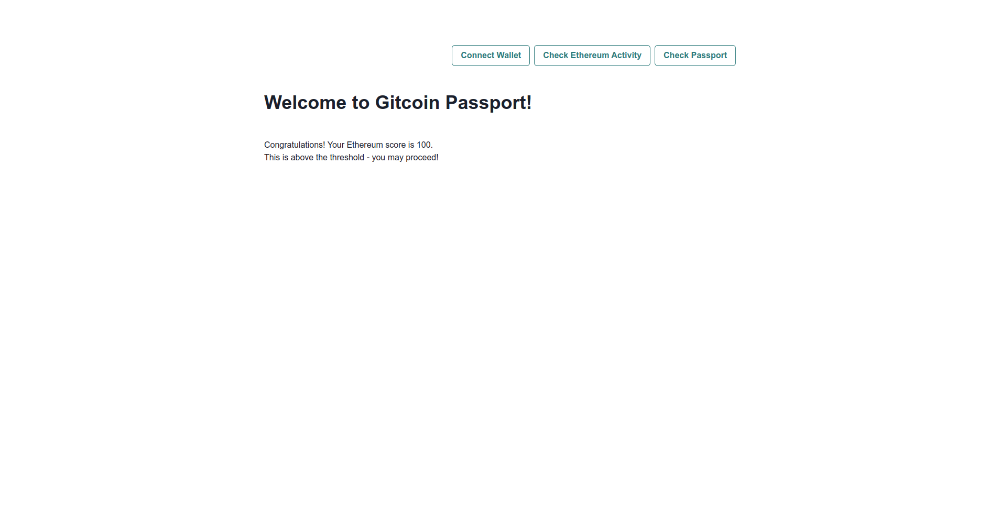

import { Callout } from 'nextra/components';

# Double Verification with the Model Based Detection and Stamp-based APIs

<Callout type="warning">
**Please note:**<br />This tutorial uses the Passport API v1. We recommend using [Passport API v2](../../passport-api-v2/overview) for new projects.<br /><br />We plan to update this tutorial to use Passport API v2 shortly.
</Callout>

This tutorial will walk you through verifying an EVM account with both the ETH Activity model (model-based detection) and the [Stamp-based method](../../passport-api/overview) in your application.

The ETH activity model is one of the [available machine learning models](../available-models.mdx) trained on known Sybil and human EVM account data that examines the transaction history for a given Ethereum address and assigns it a trust score. While this tutorial explains how to use the ETH activity model score, you can easily use any of the other available models instead.

Passport exposes an API endpoint that accepts an Ethereum account as a query parameter and returns scores between 0 (likely Sybil) and 100 (likely human), having run one of the model remotely on the Passport server.

The model itself is a black box whose outcome is based on 50+ features. Some applications may be happy to rely on these models alone; however, it is advisable to offer the Stamp-based verification method as a fallback to support those users who might not have had the chance to build up a strong account history, such as crypto beginners or experts who utilize multiple wallets for different activities.


## Prerequisites

Before we delve into this, it's important to note that there are a few preliminary steps you need to complete in order to use the Model Based Detection and Passport API. Please ensure that these prerequisites are met before proceeding with the guide.

1. You have created a Passport Scorer and received a Scorer ID (for the Passport API)
2. You have an API key (for both)

If you haven't completed the preliminary steps above please refer to our [getting access guide](../../passport-api/getting-access) first. Once you're done with that, return here and continue with this walkthrough.


## The app

This tutorial will guide you through creating a very simple app using nextjs.

The app will present you with three buttons:

- `Connect`: use this to connect your Ethereum wallet to the app.
- `Check Ethereum Activity`: clicking this button will check your Ethereum activity score. If it is above a threshold then you will see a notice of success - you may proceed to access the protected content! If you do not meet the threshold you will be denied access and directed to check your Passport unique humanity score (Stamp-based) instead.
- `Check Passport score`: clicking this button checks your Passport score on the Passport API. If your score is above a threshold then you will be allowed to proceed to the protected content!

## Getting started

We'll create an app using `Nextjs`. We can bootstrap using `create-next-app`. This automatically creates all the necessary subdirectories, configuration and boilerplate code required to get us building as quickly as possible.

Start by entering the following command into your terminal:

```sh
npx create-next-app ethereum-activity-app
```

This will create a new directory called `ethereum-activity-app` and populate it with several sub-directories and files that form the skeleton of our app. `create-next-app` will ask for yes/no responses to a series of configuration questions - answer as follows:

```sh
npx create-next-app ethereum-activity-app

✔ Would you like to use TypeScript with this project? … Yes
✔ Would you like to use ESLint with this project? … Yes
✔ Would you like to use Tailwind CSS with this project? … No
✔ Would you like to use `src/` directory with this project? … No
✔ Would you like to use experimental `app/` directory with this project? …Yes
✔ What import alias would you like configured? … @/*
```

Next, change to the new `ethereum-activity-app` directory and install `ethers`:

```sh
npm install ethers
```

This tutorial will also use [Chakra-UI](https://chakra-ui.com/) for styling, so install it using `npm`:

```bash
npm i @chakra-ui/react @emotion/react @emotion/styled framer-motion
```

Replace the contents of `app/page.tsx` with the following boilerplate code (this includes all the very basic logic to render a page and connect a wallet to the app and the logic required to check a Passport - if you need a refresher on the Passport API logic you can visit our dedicated [tutorials](../../passport-api/tutorials.mdx)):

```tsx
'use client'
import { useState, useEffect } from 'react'
import { ethers } from 'ethers'
import { ChakraProvider, Button, Flex, Heading } from '@chakra-ui/react'

const APIKEY = process.env.NEXT_PUBLIC_GC_API_KEY
const SCORERID = process.env.NEXT_PUBLIC_GC_SCORER_ID

const SUBMIT_PASSPORT_URI = 'https://api.scorer.gitcoin.co/registry/submit-passport'
const SIGNING_MESSAGE_URI = 'https://api.scorer.gitcoin.co/registry/signing-message'
const PASSPORT_THRESHOLD = 20

const headers = APIKEY ? ({
  'Content-Type': 'application/json',
  'X-API-Key': APIKEY
}) : undefined


export default function Passport() {
  // here we deal with any local state we need to manage
  const [address, setAddress] = useState<string>('')
  const [passportScore, setPassportScore] = useState<string>('')
  const [isPassportScoreAboveThreshold, setIsPassportScoreAboveThreshold] = useState<boolean>(false)
  const [isPassportChecked, setIsPassportChecked] = useState<boolean>(false)

  useEffect(() => {
    checkConnection()
    async function checkConnection() {
      try {
        const provider = new ethers.BrowserProvider(window.ethereum)
        const accounts = await provider.listAccounts()
        // if the user is connected, set their account
        if (accounts && accounts[0]) {
          setAddress(accounts[0].address)
        }
      } catch (err) {
        console.log('not connected...')
      }
    }
  }, [])


  async function connect() {
    try {
      const accounts = await window.ethereum.request({ method: 'eth_requestAccounts' })
      setAddress(accounts[0])
    } catch (err) {
      console.log('error connecting...')
    }
  }

  async function getSigningMessage() {
    try {
      const response = await fetch(SIGNING_MESSAGE_URI, {
        headers
      })
      const json = await response.json()
      return json
    } catch (err) {
      console.log('error: ', err)
    }
  }


  async function getPassportScore() {
    setPassportScore('')
    const GET_PASSPORT_SCORE_URI = `https://api.scorer.gitcoin.co/registry/score/${SCORERID}/${address}`
    try {
      const response = await fetch(GET_PASSPORT_SCORE_URI, {
        headers
      })
      const passportData = await response.json()
      if (passportData.score) {
        // if the user has a score, round it and set it in the local state
        const roundedScore = Math.round(passportData.score * 100) / 100
        setPassportScore(roundedScore.toString())
        if (roundedScore > PASSPORT_THRESHOLD) {
          setIsPassportScoreAboveThreshold(true)
        } else {
          setIsPassportScoreAboveThreshold(false)
        }
        console.log("PASSPORT SCORE = ", roundedScore)
      } else {
        // if the user has no score, display a message letting them know to submit thier passporta
        console.log('No score available, please add Stamps to your Passport and then resubmit.')
      }
    } catch (err) {
      console.log('error: ', err)
    }
  }

  const styles = {
    main: {
      width: '900px',
      margin: '0 auto',
      paddingTop: 90
    }
  }

  return (
    /* this is the UI for the app */
    <div style={styles.main}>
      <ChakraProvider>
        <Flex minWidth='max-content' alignItems='center' gap='2' justifyContent='right'>
          <Button colorScheme='teal' variant='outline' onClick={connect}>Connect Wallet</Button>
          <Button colorScheme='teal' variant='outline' onClick={checkEthereumActivity}>Check Ethereum Activity</Button>
          <Button colorScheme='teal' variant='outline' onClick={checkPassport}>Check Passport</Button>
        </Flex>
        <br />
        <br />
        <Heading>Welcome to Passport! </Heading>
        <br />
        <br />
      </ChakraProvider >
    </div >
  )
}

```

## Adding the Etheruem Activity scorer

The ETH activity scorer is accessed via a public API endpoint passing the user's Ethereum address as a query parameter. To start integrating this into your app, you can add the base URL  for the API endpoint as a constant at the top of the script, just below the Passport URI definition.

```typescript
const ETHEREUM_ACTIVITY_SCORE_URI = 'https://api.passport.xyz/v2/models/score/'
const ETHEREUM_SCORE_THRESHOLD = 50;
```


Next, we will want to track the score, and the status of your API requests in the application state. You can add one state variable to store the score retrieved from the API (a `string`), one to track whether a request has been made to the Models API (a `boolean`) and one to track whether the retrieved ETH activity score exceeds the threshoild (a `boolean`). Add the following state variable definitions beneath the existing state variable definitions in the boilerplate code:

```typescript
  const [ethereumScore, setEthereumScore] = useState<string>('')
  const [isEthereumScoreAboveThreshold, setIsEthereumScoreAboveThreshold] = useState<boolean>(false)
  const [isEthereumActivityChecked, setIsEthereumActivityChecked] = useState<boolean>(false)
```

Next, we can write some async functions that handle the request itself. We will write one function for the API request and another that wraps the API request and updates the appropriate state variables.

Start with the API request. You can call this function `getEthereumScore()`. Inside the function, first clear the existing `ethereumScore` variable, then make the API request. There is some parsing out of the `score` from the response object to handle. The score can be passed to `setEthereumScore()` to update the application state. Add some basic error handling, and the function looks as follows:

```typescript

  async function getEthereumScore() {
    setEthereumScore('')
    const GET_ETHEREUM_ACTIVITY_SCORE_URI = ETHEREUM_ACTIVITY_SCORE_URI + address
    try {
      const response = await fetch(GET_ETHEREUM_ACTIVITY_SCORE_URI, {
        headers
      })

      const ethereumData = await response.json()

      if (ethereumData.details.models.ethereum_activity.score) {
        const score = ethereumData.details.models.ethereum_activity.score
        console.log("ETHEREUM SCORE = ", score)
        // if the user has a score, round it and set it in the local state
        setEthereumScore(score.toString())

      } else {
        // if the user has no score, display a message letting them know to submit thier passporta
        console.log('No score available, please add Stamps to your Passport and then resubmit.')
      }
    } catch (err) {
      console.log('error: ', err)
    }
  }
```

Next we can write a light wrapper around `getEthereumScore()` called `checkEthereumActivity`. This wrapper will call `getEthereumScore()` and once it receives a response it will check whether the returned value exceeds the threshold and update the `isEthereumActivityChecked` variable to `true`.

```typescript
  async function checkEthereumActivity() {
    try {
      await getEthereumScore()
      if (parseInt(ethereumScore) > ETHEREUM_SCORE_THRESHOLD) {
        setIsEthereumScoreAboveThreshold(true)
      }
      else {
        setIsEthereumScoreAboveThreshold(false)
      }
      setIsEthereumActivityChecked(true)
    }
    catch {
      throw new Error('error fetching Ethereum activity score')
    }
  }
```


That's it! All the logic required to check the user's ETH activity score has been defined in your app. All that is left to do is to call these functions from the app UI.

The following code adds some conditional logic to the UI. The Ethereum activity has to be checked first. If the Ethereum activity score exceeds the threshold the app displays a success message. If the score is below the threshold it prompts the user to check their Passport score using the Passport API. If neither are successful, it displays a failure message.

Add the following code as the final content inside the `<div>` provided in return statement in the boilerplate code. 

```tsx
        {!isEthereumActivityChecked &&
          <div>
            <p><b>Welcome to our application!</b></p>
            <br />
            <p>Please check your Ethereum activity score. </p>
            <p> If your score is above the threshold - you may proceed! </p>
          </div>}
        {isEthereumActivityChecked && isEthereumScoreAboveThreshold &&
          <div>
            <p>Congratulations! Your Ethereum score is {ethereumScore}.</p>
            <p> This is above the threshold - you may proceed! </p>
          </div>
        }
        {isEthereumActivityChecked && !isEthereumScoreAboveThreshold &&
          <div>
            <p>Your Ethereum score is {ethereumScore}.</p>
            <p> Unfortunately your score is too low to proceed! </p>
            <br />
            <p> Please submit your Passport instead. </p>
          </div>
        }
        {isEthereumActivityChecked && isPassportChecked && !isEthereumScoreAboveThreshold && !isPassportScoreAboveThreshold &&
          <div>
            <p>Your Passport unique humanity score is {passportScore}.</p>
            <p> Unfortunately your score is still too low to proceed.</p>
            <br />
            <p> Please go to the Passport app and add Stamps to improve your score. </p>
          </div>
        }
        {isEthereumActivityChecked && isPassportChecked && !isEthereumScoreAboveThreshold && isPassportScoreAboveThreshold &&
          <div>
            <p>Your Passport score is {passportScore}.</p>
            <p> Unfortunately your score is still too low to proceed! </p>
            <br />
            <p> Please add Stamps to your Passport to improve your score. </p>
          </div>
        }
        {isEthereumActivityChecked && isPassportChecked && !isEthereumScoreAboveThreshold && isPassportScoreAboveThreshold &&
          <div>
            <p> Your Passport score is {passportScore}.</p>
            <p> This is above the threshold. You may proceed!</p>
          </div>
        }
```


## Run and test the app

You can start this app now by navigating your terminal to the project directory (`passport-app`) and running `npm run dev`. Then, navigate your browser to `localhost:3000`. You will see a basic app load in the browser, with buttons that enable you to connect your wallet and submit your Passport to the registry. You can go ahead and test that the `Connect` and `Submit Passport` buttons are working as expected.

Your app should look like this:


