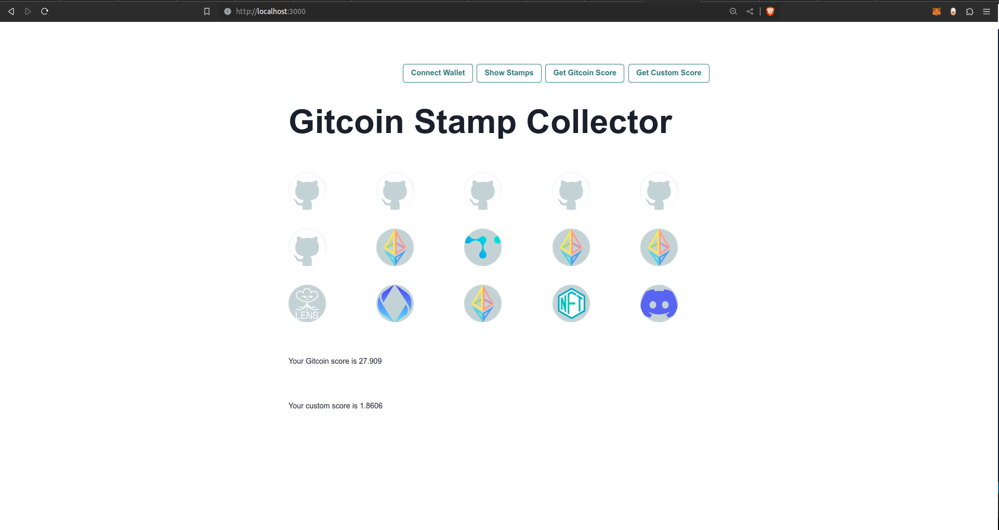

# Building a custom, client-side scorer

Gitcoin Passport offers several scoring algorithms that can be executed on the Gitcoin servers, such that a numeric score for a Passport can be requested from the Passport API. However, this means you are restricted to Gitcoin's algorithm and Gitcoin's opinion about the relative weighting assigned to each individual Stamp. This might not be appropriate for all use cases. 

For example, you might have a string preference for certain Stamps that are particularly relevant to your community that you want to weight more strongly in the scoring, or perhaps you have a great idea for a completely new algorithm that you want to implement to gate your app.

This tutorial will walk you through developing a custom scorer for your app.

### Prerequisites

Before we delve into this, it's important to note that there are a few preliminary steps you need to complete. Please ensure that these prerequisites are met before proceeding with the guide.

1. You have created a Passport Scorer and received a Scorer ID
2. You have an API key

If you haven't completed the preliminary steps above please refer to our [getting access guide](../getting-access) first. Once you're done with that, return here and continue with this walkthrough.

## Creating a Scorer

### Setting up a basic app

This tutorial will build on the [Stamp Collector app](./working-with-stamp-metadata.md) tutorial. You should revisit that tutorial to build the foundations upon which this tutorial will build. You will use that app as a starting point and add scoring functionality on top. Follow the instructions in that tutorial to get the app up and running.

You can start the app now by navigating your terminal to the project root directory and running `npm run dev`. Then, navigate your browser to `localhost:3000`. You will see the app load in the browser, with buttons that enable you to connect your wallet and check your Stamps. You can go ahead and test that the `Connect Wallet` and `Show Stamps` buttons are working as expected.

The rest of the tutorial will build upon this basic app by adding functions and UI code to `app/page.tsx`.

### Stamps

The app queries the Passport APIs `registry/stamps` endpoint to retrieve all the Stamps owned by the connected user. The `getStamps()` function parses the full response and extracts the `icon`, `id`, and `stamp` data into a `Stamp` object with the following structure:

```ts
interface Stamp {
  id: number
  stamp: string
  icon: string
}
```

This information is stored in a state variable, `stampArray`. This is all the information you need from the Passport API.

### Scorers

The Gitcoin Passport scoring algorithm is a simple sum of weights assigned to each Stamp. The weights are provided in a file on the [Gitcoin Github](https://github.com/gitcoinco/passport-scorer/blob/a013ca89ca11a22c72b384da913f73274bb8fa05/api/scorer/settings/gitcoin_passport_weights.py#L3).
Each weight is a decimal number associated with a specific Stamp name. The scoring algorithm simply iterates over the Stamp names for the Stamps owned by an address, retrieves the associated weights, and adds them together. The result is the user's Passport score.

#### The Gitcoin Scorer

You can re-implement the Gitcoin scoring algorithm easily in your app. Start by adding a file containing the Gitcoin Passport Stamp weights to your `app` directory. Copy the contents of [this file](https://github.com/jmcook1186/passport-onchain-stamps-app/blob/main/src/app/stamp-weights.ts) and paste it into a new file `app/stamp-weights.ts`.

Now, import the data into your app by adding the following import statement to `app.ts`:

```ts
import { GITCOIN_PASSPORT_WEIGHTS } from './stamp-weights';
```

You can also add two state variables: one to store the Passport score and one to toggle displaying the score in the UI:

```ts
const [score, setScore] = useState<number>()
const [showScore, setShowScore] = useState<boolean>(false)
```

Now, you can create a function to calculate the score. Name the function `calculateGitcoinScore()` to differentiate from a custom scorer you will create later. Inside, iterate over the `Stamps` in `stampArray`. Extract the name (the `stamp` field) from each `Stamp` and use it to look up the weight in `GITCOIN_PASSPORT_WEIGHTS`. Then add those together and log it to the console.

```ts
  function calculateGitcoinScore() {
    let i = 0
    var scores: Array<number> = []
    var score = 0;
    while (i < stampArray.length) {
      let id = stampArray[i].stamp
      if (GITCOIN_PASSPORT_WEIGHTS.hasOwnProperty(id)) {
        try {
          let temp_score = GITCOIN_PASSPORT_WEIGHTS[id]
          scores.push(parseFloat(temp_score))
        } catch {
          console.log("element cannot be added to cumulative score")
        }
      }
      i++;
    }
    for (let i = 0; i < scores.length; i++) {
      score += scores[i]
    }
    setShowScore(true)
    setScore(score)
  }
```

Also add a button to invoke the new function (this can be added immediately after the current button definitions in the UI code, near line 127):

```ts
<Button colorScheme='teal' variant='outline' onClick={calculateGitcoinScore}>Get Score</Button>
```

Now add a simple `Score` component:

```ts
const Score = () => {
return (
    <>
    <p> Your score is {score}</p>
    </>
)
}
```

Finally, conditionally render your `Score` component if `showScore` is toggled ON. Add the following immediately below `{showStamps && <StampCollection />}` near line 144. 

```tsx
<br />
<br />
<br />
{showScore && <Score />}
```

Now when you click the `Get Score` button in your UI, the sentence `Your score is X` is displayed under your Stamp collection! You can check this against the score given to you by the Gitcoin Passport app!

#### Custom weights

You can experiment with different weights simply by updating the values in `stamp-weights.ts`. As a simple demonstration, choose one of the Stamps you own and increase its value in `stamp-weights.ts` by 10. Next time you click `Get Score` your Passport Score will have increased by 10 too. You can experiment with weighting models that best serve your app. For example if you value web3 Stamps most strongly, you might increase their weighting relative to web2 Stamps. You can even set some Stamps to zero if you feel they are not relevant for controlling access to your content. 

#### Custom algorithms

You can also implement your own scoring algorithm. To do this, simply create a new function similar to `calculateGitcoinScore` but implement some new logic in the function body. In this tutorial you will siumply replace the summation of weights with the mean. Later, you might design some complex model to implement.

You will repeat the steps from the `calculateGitcoinScore()`. Start by adding new state variables:

```ts
const [customScore, setCustomScore] = useState<number>()
const [showCustomScore, setShowCustomScore] = useState<boolean>(false)
```

Next create a new function, `getCustomScore`. To update the score from a sum to a mean, you just need to divide the sum by the number of Stamps. You can just add a line to do this at the end of the function. Remember to update the newly created state variables!

```ts
  function calculateCustomScore() {
    let i = 0
    var scores: Array<number> = []
    var score = 0;
    while (i < stampArray.length) {
      let id = stampArray[i].stamp
      if (GITCOIN_PASSPORT_WEIGHTS.hasOwnProperty(id)) {
        try {
          let temp_score = GITCOIN_PASSPORT_WEIGHTS[id]
          scores.push(parseFloat(temp_score))
        } catch {
          console.log("element cannot be added to cumulative score")
        }
      }
      i++;
    }
    for (let i = 0; i < scores.length; i++) {
      score += scores[i]
    }
    const mean = score / stampArray.length
    setShowCustomScore(true)
    setCustomScore(mean)
  }
```

Now create a `CustomScore` component:

```ts
const CustomScore = () => {
return (
    <>
    <p> Your custom score is {customScore}</p>
    </>
)
}
```

And a button:

```ts
<Button colorScheme='teal' variant='outline' onClick={calculateCustomScore}>Get Custom Score</Button>
```

And finally add the conditional rendering to the UI code:

```tsx
<br />
<br />
<br />
{showCustomScore && <CustomScore />}
```

Now your app has buttons to show the Stamps, get a Gitcoin score and get your custom score. All this information will be displayed in the app's UI.



## Deduplication

Please note that scoring on the Gitcoin server includes Stamp deduplication. This means the server automatically detects when the same instance of a Stamp has been submitted more than once to a specific Scorer instance and ignores any duplicates. 

***While it is out of scope for this tutorial, you should implement your own deduplication to accompany a custom scorer.***

This requires logging the hashes of Stamps and checking that each hash is unique to each individual user.

## Next Steps

Now you know how Gitcoin calculates its scores and have seen how to update the logic, you can be creative in implementing algorithms that best serve your community's needs. 