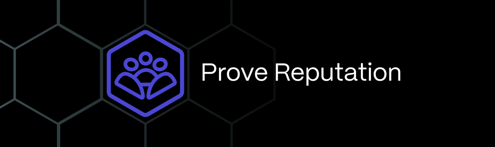

# Use cases

Human Passport's developer platform enables several key use cases:
* *Protect access* to rewards, governance, communication channels, marketplaces, and developer tools.
* *Demonstrate trustworthiness* to enable users to make better decisions about their online interaction
* *Weigh user activities based on Passport score*
* *Improve Passport’s user experience*

## Passport use cases

### Protect access: Rewards

#### Sub use cases
* Quadratic funding matching donation pools
* NFTs 
* Airdrops
* Faucets
* Quests
* Special access

#### Description
One of the primary reasons why Sybils exist is to take advantage of community rewards programs. Whether you’re offering NFTs, airdrops, faucets, or other incentives programs, you want to make sure that your rewards are going to just those humans that deserve it. 

By protecting access to Passport holders that have a score over a certain [threshold](../major-concepts/scoring-thresholds), you are ensuring that your community rewards programs are properly distributed. 

#### Active integrators
* [Gitcoin Grants](https://www.gitcoin.co/grants-stack)
* [Bankless Academy](https://www.gitcoin.co/blog/bankless-academy-a-gitcoin-passport-case-study)
* [CyberConnect](https://www.gitcoin.co/blog/gitcoin-passoort-cyberconnect-case-study)
* [Galxe](https://www.gitcoin.co/blog/gitcoin-passport-galxe)
* [Shapeshift](https://www.gitcoin.co/blog/protecting-shapeshifts-op-rewards-program-a-case-study)
* [Linea](https://www.gitcoin.co/blog/lineas-human-first-campaign-using-gitcoin-passport)

### Protect access: Governance

#### Sub use cases
* Submitting proposals
* Voting

#### Description
Running a DAO is hard enough without Sybils submitting proposals and influencing a vote in their favor. You can prevent this by protecting access to your governance platforms using Passport. 

#### Active integrators
* [Discourse](https://passport.human.tech/blog/how-to-protect-your-discourse-forum-from-bots-and-sybils-with-human-passport)
* Snapshot

### Protect access: Communications

#### Sub use cases
* Provide specific roles and permissions
* Block unwanted inbounds

#### Description
Tired of low-quality inbounds or contributions to a communication channel? Protect access to certain channels, roles, or actions within your communications platform to ensure your users have high-quality interactions.

#### Active integrators
* [Discourse](https://passport.human.tech/blog/how-to-protect-your-discourse-forum-from-bots-and-sybils-with-human-passport)
* [Guild](https://www.gitcoin.co/blog/guild-xyz-and-gitcoin-passport-partner)
* Collab.land
* Metaforo

### Protect access: Marketplace

#### Sub use cases
* NFTs
* Concert tickets
* Other products and services

#### Description
You’ve got a marketplace that is free and open for users to create and sell content. However, you’ve recently had a string of Sybils creating low-quality projects, or trying to unfairly buy all of the inventory for high-quality projects. Let Passport help to protect these. #PassportCanFixThat

### Prove reputation

#### Sub use cases
* Demonstrate user trustworthiness
* Prove user activity on web2/3

There are many situations where a user would benefit from being able to judge for themselves whether another user is trustworthy or not. By displaying Passport scores and verified Stamps, you can help your users make better decisions about who they interact with on the web. 

#### Active integrators
* [{R}elinked](https://www.gitcoin.co/blog/building-reputation-on-r-elinkd)
* Rarimo
* Sismo

### Weigh user activities according to score

#### Description
You have functionality where users help to select which content or ideas are prioritized on your platform. Let the proven humans with a strong Passport score have a heavier weight in deciding this content. 

#### Active integrators
* Gitcoin Grants

### Improve the Passport experience

#### Description
Passport is the premier solution for Sybil defense. Help us further our goals by building solutions that help to improve the user experience for people using or building on top of Passport. 

### Other community programs

We’re very interested in unique use cases that utilize the Passport developer products. 

Please feel free to reach out to us on our [Passport Developer Telegram](https://t.me/+Mcp9RsRV7tVmYjZh) to bounce new ideas off us! We will also help promote your unique ideas through our marketing channels.

## Use cases by audience

| Who you are                            | Use Case                                                                                                                                                                                                                                                                                                                                                                                                                                                                                 |
| -------------------------------------- | ---------------------------------------------------------------------------------------------------------------------------------------------------------------------------------------------------------------------------------------------------------------------------------------------------------------------------------------------------------------------------------------------------------------------------------------------------------------------------------------- |
| Event Organizer                        | Passport-gate access to an event, only allowing people with certain Stamps in their Passport to attend.   [Tutorial](../building-with-passport/tutorials/integrating-stamps-and-scorers)                                                                                                                                                                                                                                                                                         |
| Grants program manager                 | Integrate Passport into a quadratic funding (QF) program (such as Gitcoin Grants) and only offer matching funds to donors with a Passport score over a certain threshold.   [Tutorial](../building-with-passport/tutorials/integrating-stamps-and-scorers)                                                                                                                                                                                                                       |
| Community organizer                    | Gate a sub-community with Passport, only allowing access to members that have earned a certain set of Stamps through meaningful participation in the community.   [Tutorial](../building-with-passport/tutorials/integrating-stamps-and-scorers).    Enable community members to prove to other members that they are trustworthy by displaying connected Stamps on their profile.   [Tutorial](../building-with-passport/tutorials/working-with-stamp-metadata) |
| Developer of an online marketplace     | Use Passport to gate their marketplace and only allow access to or distribute funds to trusted users, aiming to reduce fraud on the platform.   [Tutorial](../building-with-passport/tutorials/gating-access-with-passport-scores)                                                                                                                                                                                                                                               |
| Airdrop experience manager             | Require users to have certain Stamps or a score above a threshold to exclude airdrop farmers.   [Tutorial](../building-with-passport/tutorials/requiring-a-passport-score-for-airdrop-claim)                                                                                                                                                                                                                                                                                     |
| Developer of an online polling service | Use Passport to gate polls by requiring participants to have a score over a certain threshold to prevent bot manipulation and increase the trustworthiness of your results.   [Tutorial](../building-with-passport/tutorials/gating-access-with-passport-scores)                                                                                                                                                                                                                 |
